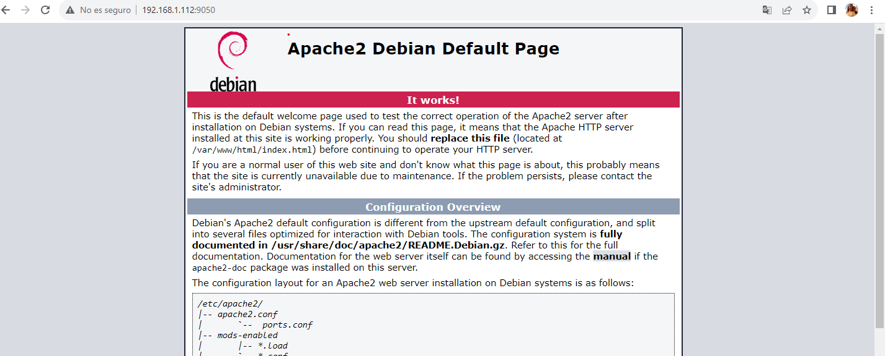

# jmcano-pilalamp-tarea
Este repositorio es para subir la tarea pila lamp en dos niveles-Modulo Implantación de Aplicaciones Web-ASIR2

*Una vez instalado todo con los scripts de provisionamiento lo primero sera comprobar que el servidor apache funciona para ello yo he puesto http://192.168.1.112:9050 en mi caso y saldra la siguiente página*

