# jmcano-pilalamp-tarea
Este repositorio es para subir la tarea pila lamp en dos niveles-Modulo Implantación de Aplicaciones Web-ASIR2

*Una vez instalado todo con los scripts de provisionamiento lo primero sera comprobar que el servidor apache funciona para ello yo he puesto http://192.168.1.112:9050 en mi caso y saldra la siguiente página.*

*Lo segundo es crear e la carpeta /var/html/wwww un archivo llamado info,php y poner la siguiente información en el fichero que nos dira el motor de php que hemos instalado.*

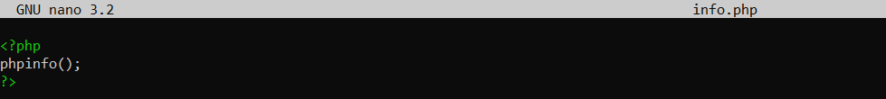

*El tercer paso es poner el navegador la ruta http://192.168.1.112:9050/info.php y se nos mostrara la siguiente información.*

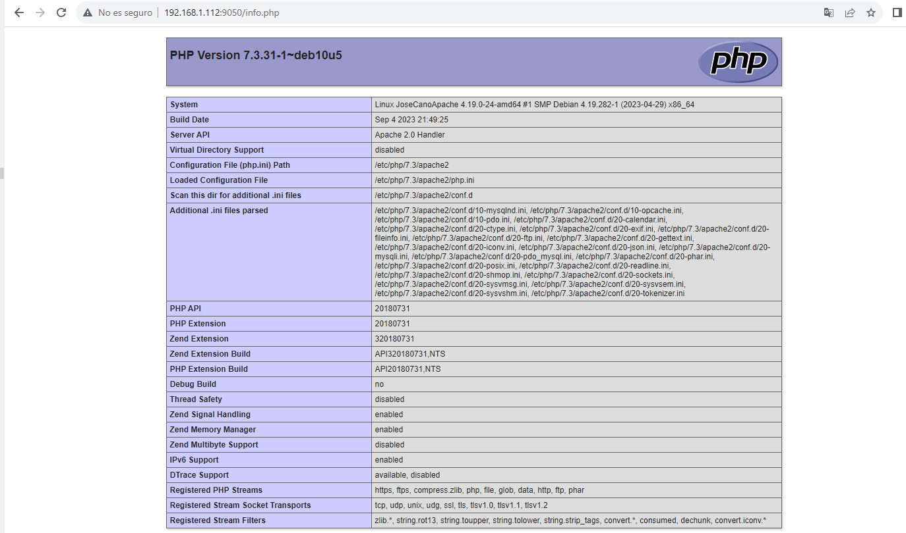

*El siguiente paso clonar el repositorio en el directorio /var/wwww/html del servidor apache y aparecera una carpeta con el nombre del repositorio y dentro de la carpeta las carpetas que necesitamos para desplegar la aplicación web.*

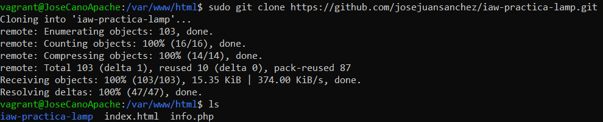

*Ahora cambiaremos de nombre a la carpeta para que sea mas accesible por el servidor apache.*

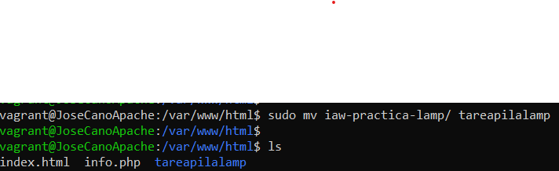

*Ahora editaremos el fichero que esta en /etc/apache2/sites-available/ llamado 000-default.conf y en el apartado document root del fichero pondremos la ruta de la carpeta src que esta dentro de la carpeta clonada y dentro de la carpeta src está un fichero index.php.*

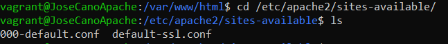

*Ahora reinciaremos el servidor apache.*

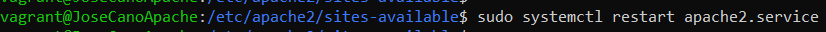

*Lo siguiente es poner de nuevo la dirección http://192.168.1.112:9050 y nos saldra la siguiente página.*

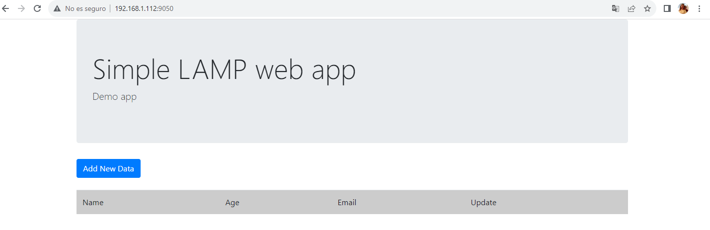

*Ahora en el servidor mysql mediante la carpeta compartida importaremos el script de la base de datos que estaba em la carpeta db dentro de la carpeta src con el siguiente comando.*

*El siguiente paso es crear un usuario con la ip del cliente que en este caso sera el servidor apache y le daremos permiso sobre la base de datos que hemos importado lamp_db.*

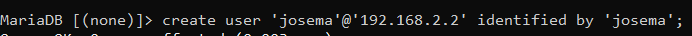

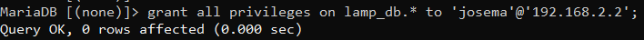

*Ahora editaremos el fichero config.php que estara en la carpeta de la aplicacion web src y pondremos en el db_host pondremos la ip del servidor mysql en db_name el nombre de la base de datos en db_user el usuario que hemos creado y en db_password la contraseña del usuario creado esto es para que el servidor apache acceda a ese usuario mediante la ip del servidor y comprobamos que solo tiene acceso a la base datos lamp_db como se ve a continuación y reniciamos el servidor apache.*

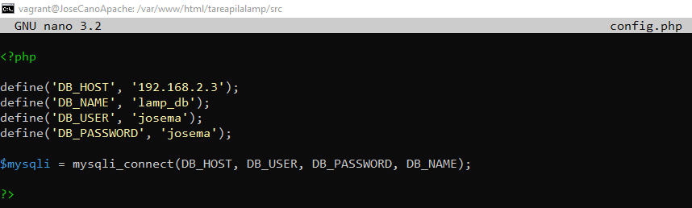

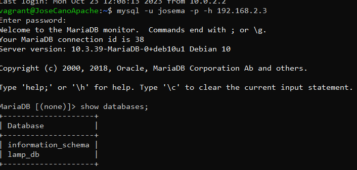

*Ahora insertaremos valores dentro de la tabla users que esta en la base de datos lamp_db de la siguietne manera.*

*Por ultimo comprobaremos que en la página del servidor apache se ha introduce el usuario que hemos metido en la tabla users.*

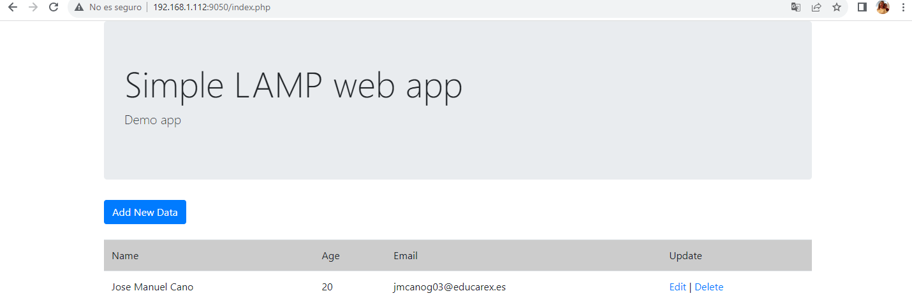

*Con estos pasos estara desplegado correctamente la aplicación web.*

*Vídeo de funcionamiento de la aplicación web*

<video src="2023-10-28%2012-34-01.mp4" controls title="Title"></video>

**Práctica realizada por José Manuel Cano González**