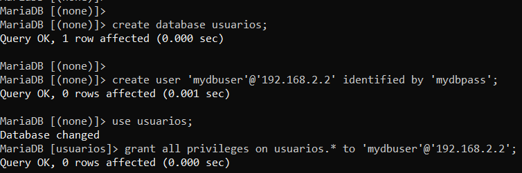
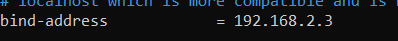

# jmcano-pilalamp-tarea
Este repositorio es para subir la tarea pila lamp en dos niveles-Modulo Implantación de Aplicaciones Web-ASIR2

*Una vez instalado todo con los scripts de provisionamiento lo primero sera comprobar que el servidor apache funciona para ello yo he puesto http://192.168.1.112:9050 en mi caso y saldra la siguiente página:*

*Lo segundo que haremos es comprobar que el servidor php está en funcionamiento para ello crearemos el archivo llamado info.php en la carpeta /var/www/html y meteremos la siguiente información:*

*Para comprobar que funciona ponemos la ruta http://192.168.1.112:9050/info.php y nos saldra la siguiente página:*

*El siguiente paso es clonar el repositorio en la carpeta /var/www/html y nos aparecera una carpeta que se llama igual que el nombre del repositorio.*

*Ahora cambiaremos el nombre de la carpeta y editaremos el fichero 000-default.conf que esta en la carpeta /etc/apache2/sites-avaliable y en la línea donde pone DocumentRoot tenemos que poner la carpeta src para que aparezca la página principal en el servidor de apache y reiniciamos el servidor apache.*

*Ahora pondre la ruta http://192.168.1.112:9050 y nos saldra la siguiente página:*

*Ahora en el servidor mysql crearemos la base de datos y un usuario y daremos acceso al usuario en esa base de datos a la hora de crear el usuario en vez de poner @localhost pondremos la ip del servidor de apache*

*Ahora editaremos el fichero 50-server.cnf que está en /etc/mysql/mariadb.conf.d y pondremos la ip del servidor mysql y reiniciamos el servicio mysql*

*Ahora iniciaremos sesión con el usuario que hemos creado para validar que la configuración es completa*

